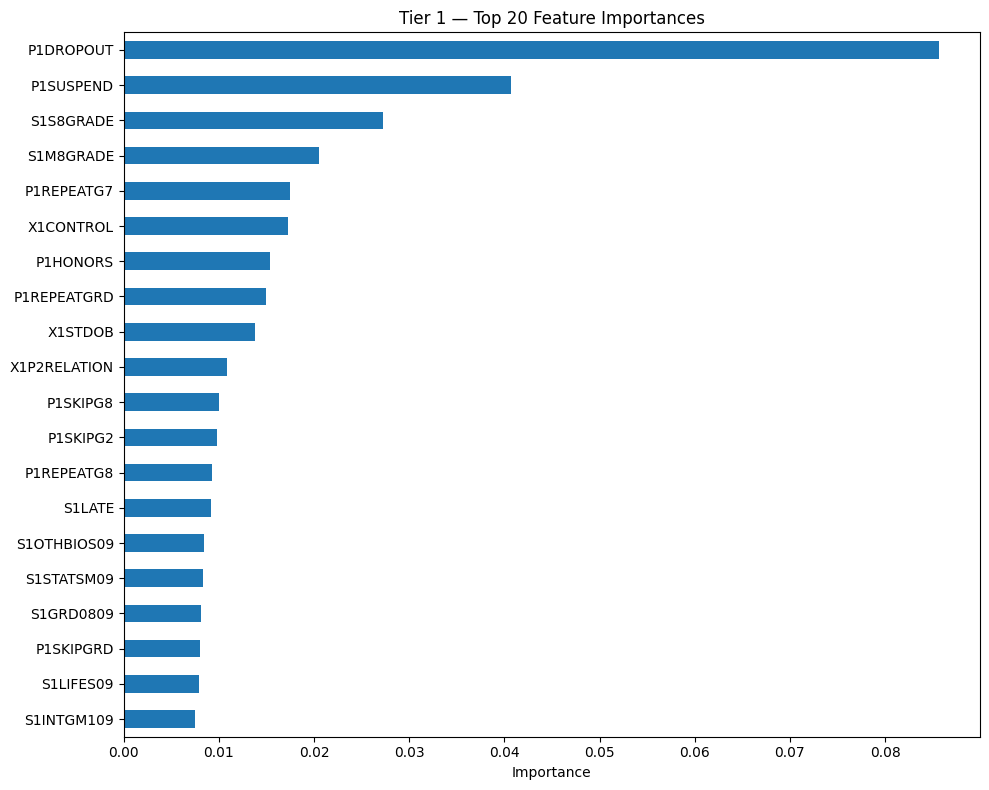
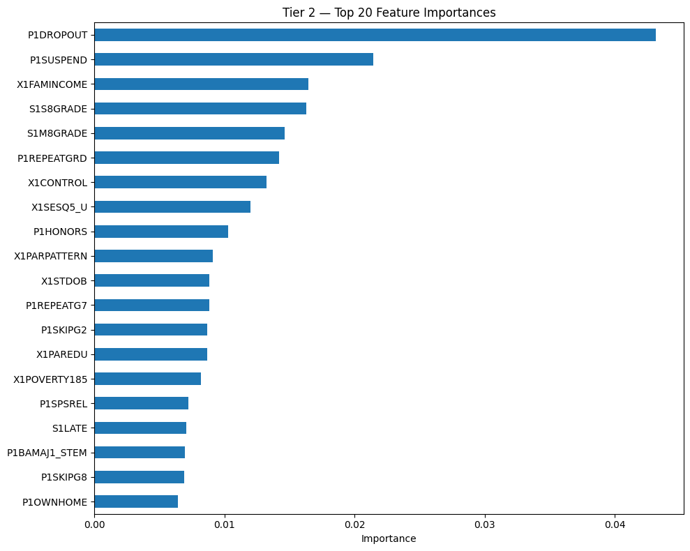
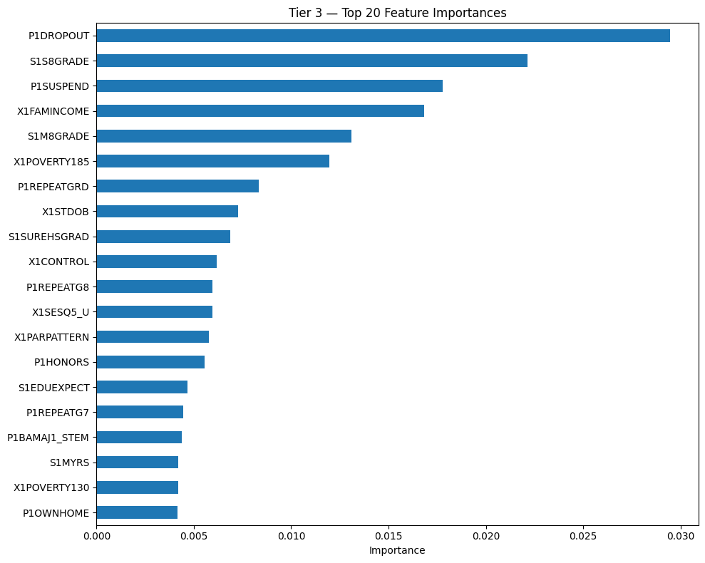
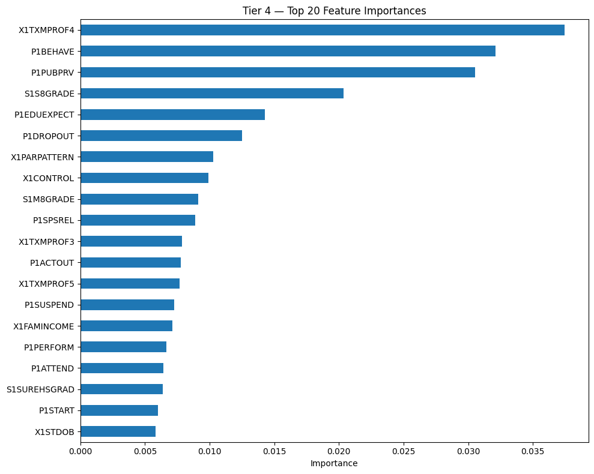
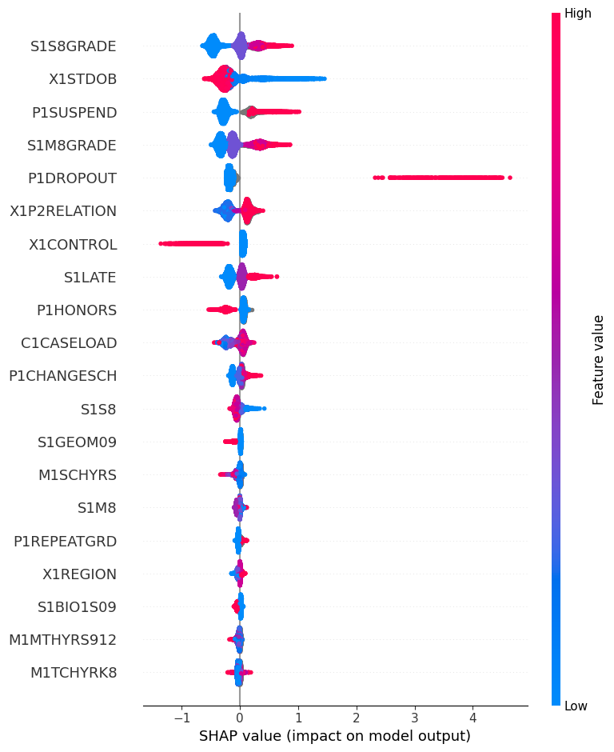
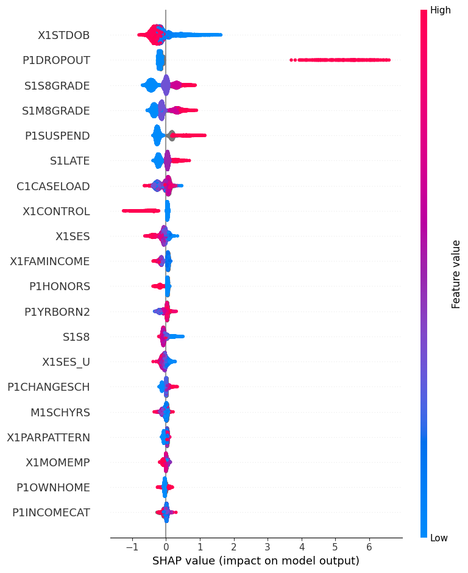
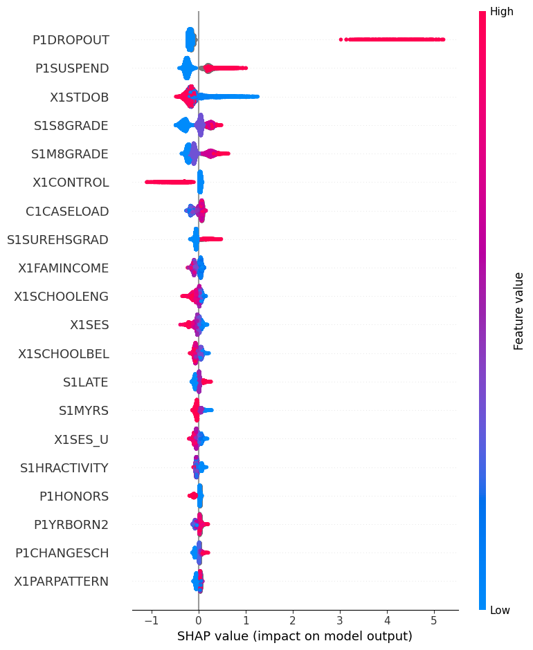
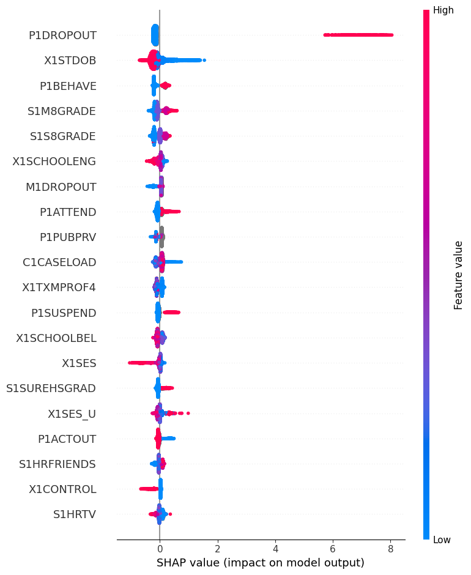
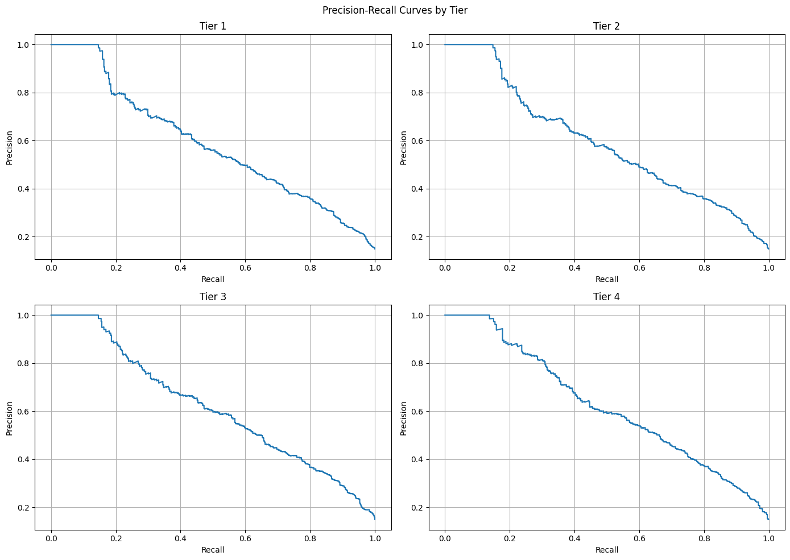

# HSLS:09 Dropout Prediction — Modelling (Any Dropout)

This notebook trains XGBoost models across four cumulative feature tiers to predict
X4EVERDROP — whether a student ever dropped out of high school. The target variable
includes both traditional dropouts and GED/alternative completers as the positive class.
The same train/test split is used across all tiers to ensure valid comparison.

Target variable: X4EVERDROP
- 0: Never dropped out (n=13,458, 85.1%)
- 1: Dropped out at any point, including GED completers (n=2,360, 14.9%)


```python
%run 05_functions_for_modelling.ipynb
```


```python
import joblib
```


```python
df = pd.read_csv('hsls_clean.csv')

with open('train_test_split.json') as f:
    split = json.load(f)

with open('feature_tiers.json') as f:
    feature_tiers = json.load(f)

train_idx = split['train']
test_idx  = split['test']
```


```python
y_train = df.loc[train_idx, 'X4EVERDROP']
y_test  = df.loc[test_idx,  'X4EVERDROP']

print(f"Train dropout rate: {y_train.mean():.4f}")
print(f"Test dropout rate:  {y_test.mean():.4f}")
print(f"Train n: {len(y_train)}, dropouts: {y_train.sum()}")
print(f"Test n:  {len(y_test)},  dropouts: {y_test.sum()}")
```

    Train dropout rate: 0.1492
    Test dropout rate:  0.1492
    Train n: 12654, dropouts: 1888
    Test n:  3164,  dropouts: 472


# Tier 1 — Coarse Search


```python
tier1_search, X_train_tier1, y_train_tier1, X_test_tier1, y_test_tier1 = fit_models(
    features=feature_tiers['tier1'], df=df, train_idx=train_idx, test_idx=test_idx)

print("Best params:", tier1_search.best_params_)
print("Best CV F1:", round(tier1_search.best_score_, 4))
```

    Fitting 5 folds for each of 100 candidates, totalling 500 fits


    Best params: {'subsample': 0.6, 'n_estimators': 750, 'max_depth': 7, 'learning_rate': 0.005, 'colsample_bytree': 0.7}
    Best CV F1: 0.5137


# Tier 1 — Fine Search


```python
fine_grid_tier1 = define_fine_grid(tier1_search.cv_results_)
tier1_fine_search = fit_fine_search(fine_grid_tier1, X_train_tier1, y_train_tier1)
```

    Score range: 0.4477 — 0.5137
    Threshold: 0.5005 (16 combinations above threshold)
    
        mean_test_f1  std_test_f1  param_n_estimators  param_max_depth  param_learning_rate  param_subsample  param_colsample_bytree
    4       0.513746     0.008695                 750                7                0.005              0.6                     0.7
    75      0.513169     0.010957                1000                6                0.005              0.6                     1.0
    89      0.512398     0.010279                 100                8                0.050              0.8                     0.7
    88      0.509692     0.007781                 300                7                0.010              0.7                     0.9
    8       0.508961     0.010500                1000                7                0.005              1.0                     0.8
    56      0.508059     0.020297                 200               10                0.005              0.9                     0.9
    57      0.507465     0.007745                 750                6                0.005              0.6                     0.7
    84      0.507102     0.010877                1000                6                0.005              0.9                     1.0
    1       0.506886     0.008118                 300                7                0.005              0.7                     0.7
    20      0.506072     0.008188                 500                6                0.010              0.9                     0.7
    60      0.505088     0.015716                 500               10                0.010              0.6                     0.5
    62      0.504702     0.021136                 300               10                0.010              0.8                     0.6
    17      0.502987     0.010508                 200                4                0.200              0.8                     0.5
    19      0.502228     0.010934                 500                3                0.050              1.0                     0.7
    3       0.500839     0.006848                1000                5                0.005              0.8                     0.6
    23      0.500712     0.003092                 300                7                0.005              0.9                     0.7
    
    param_n_estimators
    1000    4
    300     4
    500     3
    750     2
    200     2
    100     1
    Name: count, dtype: int64
    
    param_max_depth
    7     5
    6     4
    10    3
    8     1
    4     1
    3     1
    5     1
    Name: count, dtype: int64
    
    param_learning_rate
    0.005    9
    0.010    4
    0.050    2
    0.200    1
    Name: count, dtype: int64
    
    param_subsample
    0.6    4
    0.8    4
    0.9    4
    0.7    2
    1.0    2
    Name: count, dtype: int64
    
    param_colsample_bytree
    0.7    7
    1.0    2
    0.9    2
    0.5    2
    0.6    2
    0.8    1
    Name: count, dtype: int64
    
    n_estimators: [300, 500, np.int64(750), 1000]
    max_depth: [6, 7, np.int64(8), 10]
    learning_rate: [0.005, 0.01, 0.05]
    subsample: [0.6, np.float64(0.7), 0.8, 0.9]
    colsample_bytree: [0.5, 0.6, 0.7, np.float64(0.8), 0.9, 1.0]
    
    Total combinations: 1152
    Total fits (x5 folds): 5760
    Fitting 5 folds for each of 1152 candidates, totalling 5760 fits


          mean_test_f1  std_test_f1  mean_test_precision  mean_test_recall  mean_test_roc_auc  param_colsample_bytree  param_learning_rate  param_max_depth  param_n_estimators  param_subsample
    616       0.520715     0.009955             0.445003          0.627637           0.839651                     0.8                0.005                8                 750              0.6
    433       0.520209     0.013277             0.475271          0.574673           0.837292                     0.7                0.005               10                 300              0.7
    1005      0.519969     0.012566             0.454526          0.607515           0.837175                     1.0                0.005                8                1000              0.7
    485       0.519922     0.015996             0.454152          0.608038           0.837040                     0.7                0.010                8                 500              0.7
    612       0.519889     0.010203             0.435738          0.644581           0.840011                     0.8                0.005                8                 500              0.6
    472       0.519292     0.011215             0.447743          0.618109           0.838503                     0.7                0.010                7                 750              0.6
    604       0.519014     0.008844             0.430009          0.654649           0.840549                     0.8                0.005                7                1000              0.6
    295       0.518366     0.015698             0.453119          0.605923           0.836913                     0.6                0.010                8                 500              0.9
    620       0.518253     0.014229             0.454071          0.603805           0.838339                     0.8                0.005                8                1000              0.6
    805       0.518145     0.011417             0.431931          0.647762           0.839514                     0.9                0.005                8                 500              0.7


# Tier 2 — Coarse Search


```python
tier2_search, X_train_tier2, y_train_tier2, X_test_tier2, y_test_tier2 = fit_models(
    features=feature_tiers['tier2'], df=df, train_idx=train_idx, test_idx=test_idx)

print("Best params:", tier2_search.best_params_)
print("Best CV F1:", round(tier2_search.best_score_, 4))
```

    Fitting 5 folds for each of 100 candidates, totalling 500 fits


    Best params: {'subsample': 0.6, 'n_estimators': 750, 'max_depth': 7, 'learning_rate': 0.005, 'colsample_bytree': 0.7}
    Best CV F1: 0.5143


# Tier 2 — Fine Search


```python
fine_grid_tier2 = define_fine_grid(tier2_search.cv_results_)
tier2_fine_search = fit_fine_search(fine_grid_tier2, X_train_tier2, y_train_tier2)
```

    Score range: 0.4637 — 0.5143
    Threshold: 0.5042 (19 combinations above threshold)
    
        mean_test_f1  std_test_f1  param_n_estimators  param_max_depth  param_learning_rate  param_subsample  param_colsample_bytree
    4       0.514268     0.010234                 750                7                0.005              0.6                     0.7
    10      0.512903     0.014144                 200                8                0.050              1.0                     0.6
    62      0.512587     0.015379                 300               10                0.010              0.8                     0.6
    75      0.511920     0.009150                1000                6                0.005              0.6                     1.0
    60      0.511447     0.018528                 500               10                0.010              0.6                     0.5
    83      0.510475     0.011482                 100               10                0.050              1.0                     0.6
    88      0.510018     0.009028                 300                7                0.010              0.7                     0.9
    89      0.509915     0.012378                 100                8                0.050              0.8                     0.7
    57      0.509100     0.004822                 750                6                0.005              0.6                     0.7
    61      0.508561     0.019898                 750               15                0.005              0.6                     0.9
    80      0.507307     0.011555                 500                6                0.050              1.0                     0.8
    43      0.506632     0.011894                 100               15                0.010              0.6                     0.8
    63      0.506186     0.010644                 300                4                0.100              1.0                     0.5
    8       0.506161     0.009500                1000                7                0.005              1.0                     0.8
    26      0.506144     0.027332                 300                8                0.050              0.8                     0.5
    20      0.506081     0.007725                 500                6                0.010              0.9                     0.7
    96      0.505368     0.016717                 100               15                0.010              0.9                     0.8
    84      0.505209     0.007085                1000                6                0.005              0.9                     1.0
    30      0.505061     0.016407                 300                4                0.100              0.7                     0.9
    
    param_n_estimators
    300     5
    100     4
    750     3
    1000    3
    500     3
    200     1
    Name: count, dtype: int64
    
    param_max_depth
    6     5
    7     3
    8     3
    10    3
    15    3
    4     2
    Name: count, dtype: int64
    
    param_learning_rate
    0.005    6
    0.010    6
    0.050    5
    0.100    2
    Name: count, dtype: int64
    
    param_subsample
    0.6    6
    1.0    5
    0.8    3
    0.9    3
    0.7    2
    Name: count, dtype: int64
    
    param_colsample_bytree
    0.7    4
    0.8    4
    0.6    3
    0.5    3
    0.9    3
    1.0    2
    Name: count, dtype: int64
    
    n_estimators: [100, np.int64(200), 300, 500, 750, 1000]
    max_depth: [6, 7, 8, 10, 15]
    learning_rate: [0.005, 0.01, 0.05]
    subsample: [0.6, np.float64(0.7), 0.8, 0.9, 1.0]
    colsample_bytree: [0.5, 0.6, 0.7, 0.8, 0.9]
    
    Total combinations: 2250
    Total fits (x5 folds): 11250
    Fitting 5 folds for each of 2250 candidates, totalling 11250 fits


          mean_test_f1  std_test_f1  mean_test_precision  mean_test_recall  mean_test_roc_auc  param_colsample_bytree  param_learning_rate  param_max_depth  param_n_estimators  param_subsample
    1555      0.522560     0.012692             0.477105          0.577851           0.838395                     0.8                0.010                7                1000              0.6
    2001      0.522469     0.012738             0.453760          0.615991           0.841262                     0.9                0.010                7                 750              0.7
    2006      0.521461     0.014119             0.474583          0.578915           0.839270                     0.9                0.010                7                1000              0.7
    1550      0.521394     0.009529             0.453537          0.613336           0.840757                     0.8                0.010                7                 750              0.6
    1107      0.521242     0.008493             0.467996          0.588451           0.838661                     0.7                0.010                7                1000              0.8
    1686      0.521224     0.007630             0.474592          0.578392           0.836743                     0.8                0.050                7                 200              0.7
    536       0.520849     0.009874             0.454994          0.609104           0.841059                     0.6                0.005                8                1000              0.7
    2000      0.520662     0.011020             0.453612          0.611219           0.840721                     0.9                0.010                7                 750              0.6
    2026      0.520554     0.010125             0.454272          0.609636           0.840196                     0.9                0.010                8                 500              0.7
    206       0.520201     0.017469             0.466893          0.587393           0.838777                     0.5                0.010                7                1000              0.7


# Tier 3 — Coarse Search


```python
tier3_search, X_train_tier3, y_train_tier3, X_test_tier3, y_test_tier3 = fit_models(
    features=feature_tiers['tier3'], df=df, train_idx=train_idx, test_idx=test_idx)

print("Best params:", tier3_search.best_params_)
print("Best CV F1:", round(tier3_search.best_score_, 4))
```

    Fitting 5 folds for each of 100 candidates, totalling 500 fits


    Best params: {'subsample': 0.6, 'n_estimators': 750, 'max_depth': 7, 'learning_rate': 0.005, 'colsample_bytree': 0.7}
    Best CV F1: 0.5354


# Tier 3 — Fine Search


```python
fine_grid_tier3 = define_fine_grid(tier3_search.cv_results_)
tier3_fine_search = fit_fine_search(fine_grid_tier3, X_train_tier3, y_train_tier3)
```

    Score range: 0.4664 — 0.5354
    Threshold: 0.5216 (25 combinations above threshold)
    
        mean_test_f1  std_test_f1  param_n_estimators  param_max_depth  param_learning_rate  param_subsample  param_colsample_bytree
    4       0.535370     0.016904                 750                7                0.005              0.6                     0.7
    8       0.535158     0.014687                1000                7                0.005              1.0                     0.8
    84      0.533916     0.013416                1000                6                0.005              0.9                     1.0
    75      0.533444     0.012413                1000                6                0.005              0.6                     1.0
    20      0.531084     0.016313                 500                6                0.010              0.9                     0.7
    88      0.529325     0.009452                 300                7                0.010              0.7                     0.9
    57      0.529109     0.008531                 750                6                0.005              0.6                     0.7
    19      0.528879     0.007645                 500                3                0.050              1.0                     0.7
    89      0.528746     0.015896                 100                8                0.050              0.8                     0.7
    38      0.526790     0.012185                1000                4                0.010              0.8                     0.7
    10      0.526642     0.010993                 200                8                0.050              1.0                     0.6
    3       0.526334     0.011054                1000                5                0.005              0.8                     0.6
    23      0.525616     0.010337                 300                7                0.005              0.9                     0.7
    63      0.525459     0.005006                 300                4                0.100              1.0                     0.5
    45      0.525225     0.008970                 500                5                0.010              0.9                     0.9
    47      0.525125     0.008237                 300                3                0.050              0.6                     0.7
    1       0.524867     0.010324                 300                7                0.005              0.7                     0.7
    30      0.524609     0.006447                 300                4                0.100              0.7                     0.9
    48      0.524270     0.011692                1000                4                0.010              1.0                     0.7
    95      0.524030     0.005819                 500                3                0.100              0.7                     0.5
    62      0.523427     0.007498                 300               10                0.010              0.8                     0.6
    86      0.523369     0.009479                1000                5                0.005              0.9                     0.7
    56      0.522524     0.014219                 200               10                0.005              0.9                     0.9
    37      0.521697     0.007131                 300                7                0.005              0.8                     0.5
    85      0.521695     0.006463                 750                5                0.005              0.6                     0.8
    
    param_n_estimators
    300     8
    1000    7
    500     4
    750     3
    200     2
    100     1
    Name: count, dtype: int64
    
    param_max_depth
    7     6
    6     4
    4     4
    5     4
    3     3
    8     2
    10    2
    Name: count, dtype: int64
    
    param_learning_rate
    0.005    12
    0.010     6
    0.050     4
    0.100     3
    Name: count, dtype: int64
    
    param_subsample
    0.9    6
    0.6    5
    1.0    5
    0.8    5
    0.7    4
    Name: count, dtype: int64
    
    param_colsample_bytree
    0.7    11
    0.9     4
    0.6     3
    0.5     3
    0.8     2
    1.0     2
    Name: count, dtype: int64
    
    n_estimators: [300, 500, np.int64(750), 1000]
    max_depth: [4, 5, 6, 7]
    learning_rate: [0.005, 0.01, 0.05]
    subsample: [0.6, np.float64(0.7), 0.8, 0.9, 1.0]
    colsample_bytree: [0.5, 0.6, 0.7, np.float64(0.8), 0.9]
    
    Total combinations: 1200
    Total fits (x5 folds): 6000
    Fitting 5 folds for each of 1200 candidates, totalling 6000 fits


          mean_test_f1  std_test_f1  mean_test_precision  mean_test_recall  mean_test_roc_auc  param_colsample_bytree  param_learning_rate  param_max_depth  param_n_estimators  param_subsample
    558       0.545758     0.017482             0.474464          0.642466           0.851392                     0.7                0.005                7                1000              0.9
    391       0.543683     0.015217             0.508541          0.584208           0.850110                     0.6                0.010                7                 750              0.7
    628       0.543159     0.014427             0.474384          0.635580           0.851239                     0.7                0.010                7                 500              0.9
    373       0.542831     0.013774             0.462195          0.657836           0.852485                     0.6                0.010                6                 750              0.9
    1098      0.542555     0.013077             0.489326          0.609107           0.851017                     0.9                0.010                6                1000              0.9
    868       0.542275     0.013542             0.470912          0.639291           0.850510                     0.8                0.010                7                 500              0.9
    1108      0.541844     0.013165             0.472910          0.634518           0.850622                     0.9                0.010                7                 500              0.9
    377       0.541771     0.011422             0.485346          0.613337           0.852074                     0.6                0.010                6                1000              0.8
    153       0.541738     0.010294             0.506414          0.582622           0.850043                     0.5                0.010                7                 750              0.9
    315       0.541735     0.017409             0.475364          0.629755           0.852166                     0.6                0.005                7                1000              0.6


# Tier 4 — Coarse Search


```python
tier4_search, X_train_tier4, y_train_tier4, X_test_tier4, y_test_tier4 = fit_models(
    features=feature_tiers['tier4'], df=df, train_idx=train_idx, test_idx=test_idx)

print("Best params:", tier4_search.best_params_)
print("Best CV F1:", round(tier4_search.best_score_, 4))
```

    Fitting 5 folds for each of 100 candidates, totalling 500 fits


    Best params: {'subsample': 1.0, 'n_estimators': 1000, 'max_depth': 7, 'learning_rate': 0.005, 'colsample_bytree': 0.8}
    Best CV F1: 0.5451


# Tier 4 — Fine Search


```python
fine_grid_tier4 = define_fine_grid(tier4_search.cv_results_)
tier4_fine_search = fit_fine_search(fine_grid_tier4, X_train_tier4, y_train_tier4)
```

    Score range: 0.4661 — 0.5451
    Threshold: 0.5293 (26 combinations above threshold)
    
        mean_test_f1  std_test_f1  param_n_estimators  param_max_depth  param_learning_rate  param_subsample  param_colsample_bytree
    8       0.545095     0.020159                1000                7                0.005              1.0                     0.8
    89      0.544589     0.013746                 100                8                0.050              0.8                     0.7
    63      0.543773     0.004907                 300                4                0.100              1.0                     0.5
    75      0.543768     0.011398                1000                6                0.005              0.6                     1.0
    4       0.543401     0.010958                 750                7                0.005              0.6                     0.7
    88      0.541052     0.010152                 300                7                0.010              0.7                     0.9
    62      0.540580     0.014545                 300               10                0.010              0.8                     0.6
    44      0.539001     0.013693                 200                3                0.100              0.9                     0.7
    84      0.538332     0.013023                1000                6                0.005              0.9                     1.0
    38      0.537774     0.010173                1000                4                0.010              0.8                     0.7
    20      0.537474     0.009760                 500                6                0.010              0.9                     0.7
    57      0.536979     0.012813                 750                6                0.005              0.6                     0.7
    56      0.536934     0.017798                 200               10                0.005              0.9                     0.9
    19      0.536700     0.011059                 500                3                0.050              1.0                     0.7
    48      0.535160     0.014177                1000                4                0.010              1.0                     0.7
    13      0.535011     0.009471                1000                4                0.050              1.0                     0.7
    3       0.533873     0.009743                1000                5                0.005              0.8                     0.6
    82      0.532832     0.015689                 300                5                0.100              1.0                     0.9
    95      0.532777     0.011132                 500                3                0.100              0.7                     0.5
    22      0.532461     0.009048                 200                3                0.100              0.6                     0.7
    30      0.532379     0.011587                 300                4                0.100              0.7                     0.9
    86      0.532263     0.010146                1000                5                0.005              0.9                     0.7
    1       0.532067     0.008260                 300                7                0.005              0.7                     0.7
    45      0.531831     0.007883                 500                5                0.010              0.9                     0.9
    85      0.531416     0.010731                 750                5                0.005              0.6                     0.8
    21      0.529905     0.006026                 200                3                0.050              0.8                     0.8
    
    param_n_estimators
    1000    8
    300     6
    200     4
    500     4
    750     3
    100     1
    Name: count, dtype: int64
    
    param_max_depth
    4     5
    3     5
    5     5
    7     4
    6     4
    10    2
    8     1
    Name: count, dtype: int64
    
    param_learning_rate
    0.005    10
    0.100     6
    0.010     6
    0.050     4
    Name: count, dtype: int64
    
    param_subsample
    1.0    6
    0.9    6
    0.8    5
    0.6    5
    0.7    4
    Name: count, dtype: int64
    
    param_colsample_bytree
    0.7    12
    0.9     5
    0.8     3
    0.5     2
    1.0     2
    0.6     2
    Name: count, dtype: int64
    
    n_estimators: [200, 300, 500, np.int64(750), 1000]
    max_depth: [3, 4, 5]
    learning_rate: [0.005, 0.01, np.float64(0.05), 0.1]
    subsample: [0.6, np.float64(0.7), 0.8, 0.9, 1.0]
    colsample_bytree: [0.7, 0.8, 0.9]
    
    Total combinations: 900
    Total fits (x5 folds): 4500
    Fitting 5 folds for each of 900 candidates, totalling 4500 fits


    /opt/anaconda3/envs/hsls_env/lib/python3.11/site-packages/joblib/externals/loky/process_executor.py:782: UserWarning: A worker stopped while some jobs were given to the executor. This can be caused by a too short worker timeout or by a memory leak.
      warnings.warn(


         mean_test_f1  std_test_f1  mean_test_precision  mean_test_recall  mean_test_roc_auc  param_colsample_bytree  param_learning_rate  param_max_depth  param_n_estimators  param_subsample
    539      0.549883     0.012338             0.478800          0.646189           0.847247                     0.8                 0.10                3                 500              1.0
    201      0.549848     0.012019             0.466031          0.670553           0.857143                     0.7                 0.05                5                 200              0.7
    506      0.549126     0.009260             0.500396          0.608585           0.852734                     0.8                 0.05                5                 300              0.7
    809      0.549090     0.015015             0.483466          0.635591           0.853385                     0.9                 0.05                5                 300              1.0
    244      0.549045     0.016503             0.504209          0.602754           0.845161                     0.7                 0.10                3                 750              1.0
    505      0.549019     0.019988             0.500721          0.608053           0.853677                     0.8                 0.05                5                 300              0.6
    806      0.548375     0.016228             0.500018          0.607522           0.855772                     0.9                 0.05                5                 300              0.7
    206      0.548331     0.013453             0.495556          0.613873           0.855220                     0.7                 0.05                5                 300              0.7
    147      0.548218     0.013623             0.464317          0.669489           0.859803                     0.7                 0.01                5                1000              0.8
    746      0.548206     0.012831             0.468684          0.660486           0.859942                     0.9                 0.01                5                1000              0.7


# Save Models and Data


```python
joblib.dump(tier1_fine_search, 'tier1_fine_search.pkl')
joblib.dump(tier2_fine_search, 'tier2_fine_search.pkl')
joblib.dump(tier3_fine_search, 'tier3_fine_search.pkl')
joblib.dump(tier4_fine_search, 'tier4_fine_search.pkl')

joblib.dump((X_train_tier1, y_train_tier1, X_test_tier1, y_test_tier1), 'data_tier1.pkl')
joblib.dump((X_train_tier2, y_train_tier2, X_test_tier2, y_test_tier2), 'data_tier2.pkl')
joblib.dump((X_train_tier3, y_train_tier3, X_test_tier3, y_test_tier3), 'data_tier3.pkl')
joblib.dump((X_train_tier4, y_train_tier4, X_test_tier4, y_test_tier4), 'data_tier4.pkl')

print("All models and data saved.")
```

    All models and data saved.


# Evaluation of all models


```python
evaluate_model(tier1_fine_search, X_train_tier1, y_train_tier1, X_test_tier1, y_test_tier1, tier=1)
evaluate_model(tier2_fine_search, X_train_tier2, y_train_tier2, X_test_tier2, y_test_tier2, tier=2)
evaluate_model(tier3_fine_search, X_train_tier3, y_train_tier3, X_test_tier3, y_test_tier3, tier=3)
evaluate_model(tier4_fine_search, X_train_tier4, y_train_tier4, X_test_tier4, y_test_tier4, tier=4)
```

    Tier 1 — Training Set Evaluation
    Accuracy:  0.8974
    ROC-AUC:   0.9653
    
                  precision    recall  f1-score   support
    
               0       0.98      0.90      0.94     10766
               1       0.61      0.89      0.72      1888
    
        accuracy                           0.90     12654
       macro avg       0.79      0.90      0.83     12654
    weighted avg       0.92      0.90      0.90     12654
    


    Tier 1 — Test Set Evaluation
    Accuracy:  0.8344
    ROC-AUC:   0.8494
    
                  precision    recall  f1-score   support
    
               0       0.93      0.87      0.90      2692
               1       0.46      0.64      0.54       472
    
        accuracy                           0.83      3164
       macro avg       0.70      0.76      0.72      3164
    weighted avg       0.86      0.83      0.85      3164
    


    Tier 2 — Training Set Evaluation
    Accuracy:  0.9373
    ROC-AUC:   0.9900
    
                  precision    recall  f1-score   support
    
               0       1.00      0.93      0.96     10766
               1       0.71      0.97      0.82      1888
    
        accuracy                           0.94     12654
       macro avg       0.85      0.95      0.89     12654
    weighted avg       0.95      0.94      0.94     12654
    
    Tier 2 — Test Set Evaluation
    Accuracy:  0.8439
    ROC-AUC:   0.8532
    
                  precision    recall  f1-score   support
    
               0       0.93      0.88      0.91      2692
               1       0.48      0.61      0.54       472
    
        accuracy                           0.84      3164
       macro avg       0.71      0.75      0.72      3164
    weighted avg       0.86      0.84      0.85      3164
    


    Tier 3 — Training Set Evaluation
    Accuracy:  0.9248
    ROC-AUC:   0.9856
    
                  precision    recall  f1-score   support
    
               0       0.99      0.92      0.95     10766
               1       0.68      0.95      0.79      1888
    
        accuracy                           0.92     12654
       macro avg       0.83      0.93      0.87     12654
    weighted avg       0.94      0.92      0.93     12654
    
    Tier 3 — Test Set Evaluation
    Accuracy:  0.8426
    ROC-AUC:   0.8637
    
                  precision    recall  f1-score   support
    
               0       0.94      0.88      0.90      2692
               1       0.48      0.66      0.55       472
    
        accuracy                           0.84      3164
       macro avg       0.71      0.77      0.73      3164
    weighted avg       0.87      0.84      0.85      3164
    
    Tier 4 — Training Set Evaluation
    Accuracy:  0.9222
    ROC-AUC:   0.9840
    
                  precision    recall  f1-score   support
    
               0       0.99      0.92      0.95     10766
               1       0.67      0.96      0.79      1888
    
        accuracy                           0.92     12654
       macro avg       0.83      0.94      0.87     12654
    weighted avg       0.94      0.92      0.93     12654
    
    Tier 4 — Test Set Evaluation
    Accuracy:  0.8404
    ROC-AUC:   0.8658
    
                  precision    recall  f1-score   support
    
               0       0.94      0.87      0.90      2692
               1       0.48      0.68      0.56       472
    
        accuracy                           0.84      3164
       macro avg       0.71      0.77      0.73      3164
    weighted avg       0.87      0.84      0.85      3164
    


# Results Summary


```python
from sklearn.metrics import f1_score, recall_score, precision_score, roc_auc_score, accuracy_score

summary = []

for tier, fine_search, X_train, y_train, X_test, y_test in [
    (1, tier1_fine_search, X_train_tier1, y_train_tier1, X_test_tier1, y_test_tier1),
    (2, tier2_fine_search, X_train_tier2, y_train_tier2, X_test_tier2, y_test_tier2),
    (3, tier3_fine_search, X_train_tier3, y_train_tier3, X_test_tier3, y_test_tier3),
    (4, tier4_fine_search, X_train_tier4, y_train_tier4, X_test_tier4, y_test_tier4),
]:
    model = fine_search.best_estimator_
    y_pred = model.predict(X_test)
    y_prob = model.predict_proba(X_test)[:, 1]

    summary.append({
        'Tier': tier,
        'Features': X_test.shape[1],
        'CV F1': round(fine_search.best_score_, 4),
        'Test Accuracy': round(accuracy_score(y_test, y_pred), 4),
        'Test Precision': round(precision_score(y_test, y_pred), 4),
        'Test Recall': round(recall_score(y_test, y_pred), 4),
        'Test F1': round(f1_score(y_test, y_pred), 4),
        'Test ROC-AUC': round(roc_auc_score(y_test, y_prob), 4),
    })

summary_df = pd.DataFrame(summary)
print(summary_df.to_string(index=False))
```

     Tier  Features  CV F1  Test Accuracy  Test Precision  Test Recall  Test F1  Test ROC-AUC
        1       130 0.5207         0.8344          0.4606       0.6441   0.5371        0.8494
        2       192 0.5226         0.8439          0.4817       0.6144   0.5400        0.8532
        3       436 0.5458         0.8426          0.4799       0.6568   0.5546        0.8637
        4       833 0.5499         0.8404          0.4754       0.6758   0.5582        0.8658


# Feature Importance


```python
show_feature_importance(tier1_fine_search, X_train_tier1, tier=1)
show_feature_importance(tier2_fine_search, X_train_tier2, tier=2)
show_feature_importance(tier3_fine_search, X_train_tier3, tier=3)
show_feature_importance(tier4_fine_search, X_train_tier4, tier=4)
```


    

    


    Tier 1 — Bottom 20 features:
    S1EARTHS09       0.005247
    P1REPEATG2       0.005213
    M1CERT912        0.005172
    S1ADVM09         0.005166
    S1ADVPHYSIC09    0.005165
    P1REPEATG3       0.005153
    X1BLACK          0.005134
    X1RACE           0.005123
    S1OTHPHYS09      0.005099
    X1P1RELATION     0.005075
    P1USBORN9        0.004913
    S1TRIGM09        0.004790
    X1HISPANIC       0.004758
    S1REVM09         0.004717
    P1REPEATG6       0.004715
    X1SEX            0.004696
    P1DD             0.004552
    S1MFALL09        0.004421
    S1SFALL09        0.004143
    P1REPEATG9       0.004021
    


    

    


    Tier 2 — Bottom 20 features:
    X1BLACK        0.003604
    X1WHITE        0.003593
    S1PREALGM09    0.003590
    X1PAR1EDU      0.003588
    S1EARTHS09     0.003546
    X1RACE         0.003540
    A1G9TCHREF     0.003535
    S1TRIGM09      0.003512
    P1USBORN9      0.003495
    S1SFALL09      0.003359
    X1SEX          0.003357
    S1REVM09       0.003353
    S1INTGM209     0.003349
    P1HHPARENT     0.003301
    S1MFALL09      0.003233
    X1HISPANIC     0.003144
    P1JOBEVER2     0.003004
    S1ANGEOM09     0.002742
    P1JOBEVER1     0.002735
    S1ADVM09       0.002229
    


    

    


    Tier 3 — Bottom 20 features:
    C1PRNTREFER      0.001345
    X1BLACK          0.001333
    X1PAR1EDU        0.001284
    S1NOTALKCLG      0.001281
    S1MFALL09        0.001236
    P1INTELLECT      0.001231
    P1REPEATG6       0.001231
    X1MOMREL         0.001222
    S1OTHPHYS09      0.001222
    S1INTGM209       0.001215
    P1SKIPGK         0.001211
    S1GENS09         0.001160
    S1OTHBIOS09      0.001116
    X1HISPANIC       0.001017
    X1DUALLANG       0.000923
    S1REVM09         0.000880
    S1ADVM09         0.000791
    S1TRIGM09        0.000790
    P1JOBEVER1       0.000425
    S1ADVPHYSIC09    0.000000
    


    

    


    Tier 4 — Bottom 20 features:
    P1CAMPMS        0.0
    P1QHELP         0.0
    P1PREPPAY       0.0
    P1HELPPAY       0.0
    P1FEEOUT        0.0
    P1ADMITREQ      0.0
    P1ABLEBA        0.0
    P1STEMDISC      0.0
    P1NOOUTSCH      0.0
    P1RELIGGRP      0.0
    P1ADHD          0.0
    P1ARTS          0.0
    P1COUNSELOR     0.0
    P1SCHCHOICE     0.0
    P1SKIPG3        0.0
    P1SKIPG1        0.0
    P1SKIPGK        0.0
    P1FRIEND        0.0
    P1LEARN         0.0
    C1BAMAJ_STEM    0.0
    


# Feature Importance Comparison Across Tiers


```python
compare_feature_importance(
    [tier1_fine_search, tier2_fine_search, tier3_fine_search, tier4_fine_search],
    [X_train_tier1, X_train_tier2, X_train_tier3, X_train_tier4])
```

    Feature overlap across tiers (top 20 each):
    Feature                     T1   T2   T3   T4  Tiers
    --------------------------------------------------
    P1SUSPEND                    2    2    3   14      4
    P1DROPOUT                    1    1    1    6      4
    X1CONTROL                    6    7   10    8      4
    S1M8GRADE                    4    5    5    9      4
    S1S8GRADE                    3    4    2    4      4
    X1STDOB                      9   11    8   20      4
    P1HONORS                     7    9   14    -      3
    X1FAMINCOME                  -    3    4   15      3
    X1PARPATTERN                 -   10   13    7      3
    P1REPEATGRD                  8    6    7    -      3
    P1REPEATG7                   5   12   16    -      3
    S1LATE                      14   17    -    -      2
    P1SPSREL                     -   16    -   10      2
    P1SKIPG2                    12   13    -    -      2
    P1BAMAJ1_STEM                -   18   17    -      2
    P1OWNHOME                    -   20   20    -      2
    X1POVERTY185                 -   15    6    -      2
    P1REPEATG8                  13    -   11    -      2
    P1SKIPG8                    11   19    -    -      2
    X1SESQ5_U                    -    8   12    -      2
    S1SUREHSGRAD                 -    -    9   18      2
    
    Average rank across tiers (only where in top 20):
    Feature                     Avg Rank  Tiers
    ---------------------------------------------
    P1DROPOUT                       2.25      4
    S1S8GRADE                       3.25      4
    P1SUSPEND                       5.25      4
    S1M8GRADE                       5.75      4
    X1CONTROL                       7.75      4
    X1STDOB                        12.00      4
    P1REPEATGRD                     7.00      3
    X1FAMINCOME                     7.33      3
    P1HONORS                       10.00      3
    X1PARPATTERN                   10.00      3
    P1REPEATG7                     11.00      3
    X1SESQ5_U                      10.00      2
    X1POVERTY185                   10.50      2
    P1REPEATG8                     12.00      2
    P1SKIPG2                       12.50      2
    P1SPSREL                       13.00      2
    S1SUREHSGRAD                   13.50      2
    P1SKIPG8                       15.00      2
    S1LATE                         15.50      2
    P1BAMAJ1_STEM                  17.50      2
    P1OWNHOME                      20.00      2


# SHAP Analysis


```python
plot_shap(tier1_fine_search, X_train_tier1, tier=1)
plot_shap(tier2_fine_search, X_train_tier2, tier=2)
plot_shap(tier3_fine_search, X_train_tier3, tier=3)
plot_shap(tier4_fine_search, X_train_tier4, tier=4)
```

    Tier 1 — SHAP Summary Plot


    

    


    Tier 2 — SHAP Summary Plot


    

    


    Tier 3 — SHAP Summary Plot


    

    


    Tier 4 — SHAP Summary Plot


    

    


# Precision-Recall Curves


```python
from sklearn.metrics import precision_recall_curve

fig, axes = plt.subplots(2, 2, figsize=(14, 10))
axes = axes.flatten()

for i, (tier, fine_search, X_test, y_test) in enumerate([
    (1, tier1_fine_search, X_test_tier1, y_test_tier1),
    (2, tier2_fine_search, X_test_tier2, y_test_tier2),
    (3, tier3_fine_search, X_test_tier3, y_test_tier3),
    (4, tier4_fine_search, X_test_tier4, y_test_tier4),
]):
    model = fine_search.best_estimator_
    y_prob = model.predict_proba(X_test)[:, 1]
    precisions, recalls, _ = precision_recall_curve(y_test, y_prob)
    axes[i].plot(recalls, precisions)
    axes[i].set_title(f'Tier {tier}')
    axes[i].set_xlabel('Recall')
    axes[i].set_ylabel('Precision')
    axes[i].grid(True)

plt.suptitle('Precision-Recall Curves by Tier')
plt.tight_layout()
plt.show()
```


    

    

